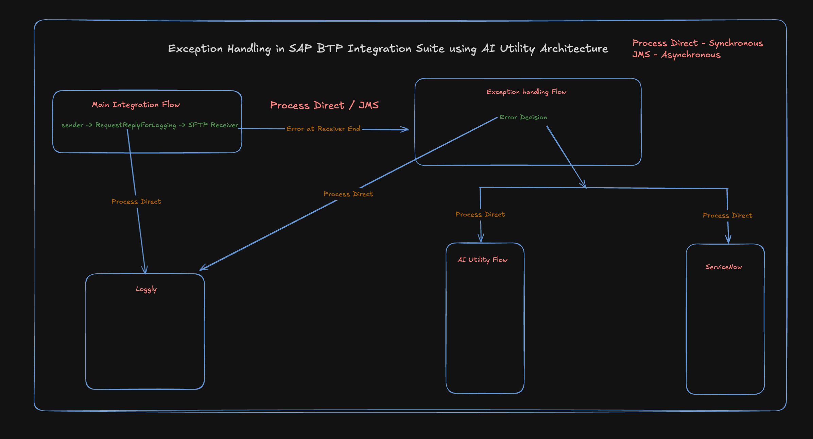

# Exception Handling in SAP BTP Integration Suite Using AI Utility Flows - Part 1

## Introduction

**Hello everyone!** 

Recently, I worked on an SAP integration project where good error handling was very important. When systems talk to each other, errors can break the whole process or cause missed alerts. This can hurt your business and make Business users unhappy.

To fix this problem, I built a smart error handling system. It uses normal SAP tools plus AI to automatically make error messages better and send smart alerts. This way, when something goes wrong, people get clear error description and the potential fix for it. 

This blog will show you how to build strong integration flows that handle errors well and give useful feedback to both technical and business users.

---

## What You Will Learn

By the end of this blog series, you will know:

- **Synchronous vs Asynchronous Exception Handling** in SAP Integration Suite
- How to build integration flows that keep working even when errors happen  
- How to use AI tools like Google Gemini to make error messages easy to understand  
- How to send alerts to multiple systems (ServiceNow, Loggly) when errors happen
- Best ways to handle errors safely in SAP Integration Suite
- Real examples you can use in your own projects

---

## Synchronous vs Asynchronous Exception Handling

You need to know when and how to handle errors to build good integrations. The way you do it depends on your integration type and business needs.

### Synchronous Integrations

**When to Use:**
- **Sender Adapter:** IDOC, HTTP  
- **Receiver Adapter:** SFTP  
- **Important:** An error in the integration flow must **not stop** message delivery to the target system.

**How to Fix:**
Use **Escalation End** events in subprocess utilities. This means if errors happen during error handling or alerts, the main process keeps running and your business logic stays safe.

**Example:**  
Main Integration: HTTP → RequestReply for connectivity check → SFTP file placement (if no errors).  
When an error happens, a GenAI-powered subprocess makes smart error responses using escalation ends, so the main flow finishes successfully.

### Asynchronous Integrations

**When to Use:**
- **Sender Adapter:** IDOC, HTTP  
- **Receiver Adapter:** SFTP  
- **Important:** Message delivery runs on its own, so utility flows **do not need** Escalation Ends.

**How to Fix:**
Use **JMS (Java Messaging Service)** for asynchronous messaging. Any errors are logged or handled in side branches but don't hurt overall message reliability or system performance.

**Benefits:**
- Better performance and can handle more work
- Less connection between parts
- Errors stay isolated naturally

---

## Architecture Overview

The solution I built has two main integration flows working together to handle errors well:

### 1. Main Integration Flow
**What it does:** Main business logic and error detection

**Key Jobs:**
- Gets HTTP messages from other systems
- Checks if external systems (like Loggly) are working
- Sends successful messages to SFTP for file storage
- Calls AI-powered error utility when errors happen
- Keeps business running even when errors occur

### 2. GenAI Utility Flow
**What it does:** Smart error processing and sending alerts to multiple places

**Key Jobs:**
- Gets error information from the main flow
- Calls AI service (Google Gemini) to make error messages easy to understand
- Creates a standard error XML format for consistent processing
- Sends alerts to multiple systems:
  - **ServiceNow** for incident management
  - **Loggly** for centralized logging

### Why This Architecture is Good

- **Fault Tolerance:** Main business processes keep running even if error handling fails
- **Intelligence:** AI-generated messages give context and helpful insights
- **Complete Coverage:** Multiple alert channels make sure no errors are missed
- **Scalability:** Parallel processing supports high-volume scenarios
- **Easy to Maintain:** Clear separation between business logic and error handling

---

## Next Steps

In the next part of this blog series, we'll go through the step-by-step setup, including:

- How to set up the main integration flow
- Complete Groovy scripts for AI integration
- ServiceNow, Loggly flows
- How to test and fix problems
- Real examples and best practices

Stay tuned for the hands-on setup guide!

---

*Ready to build strong SAP integrations? Let's continue to Part 2 where we'll build this architecture step by step.*

Have you ever faced a situation where an integration flow fails, and the error message makes no sense?

In my new blog, I talk about how I built a smart error handling system in SAP Integration Suite that uses AI to make error messages clear and helpful. It also sends automatic alerts to tools like ServiceNow and Loggly, so no issue goes unnoticed.

In this first part, you’ll learn the basics — how to handle errors in synchronous and asynchronous flows, and how a simple two-flow setup (Main Flow + AI Utility Flow) can keep your integrations running smoothly.

If you want your integrations to talk back with clear error messages and smart alerts, this blog is for you.