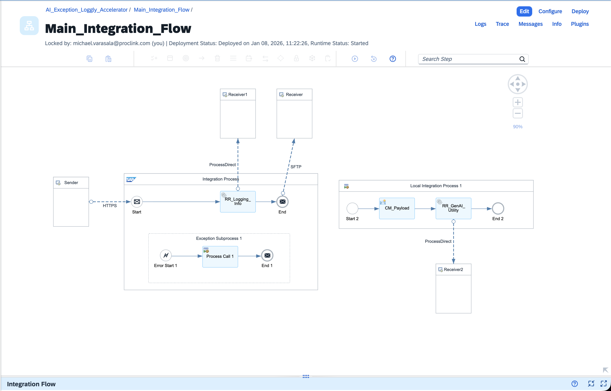
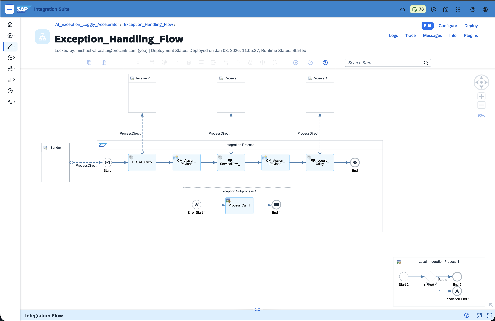
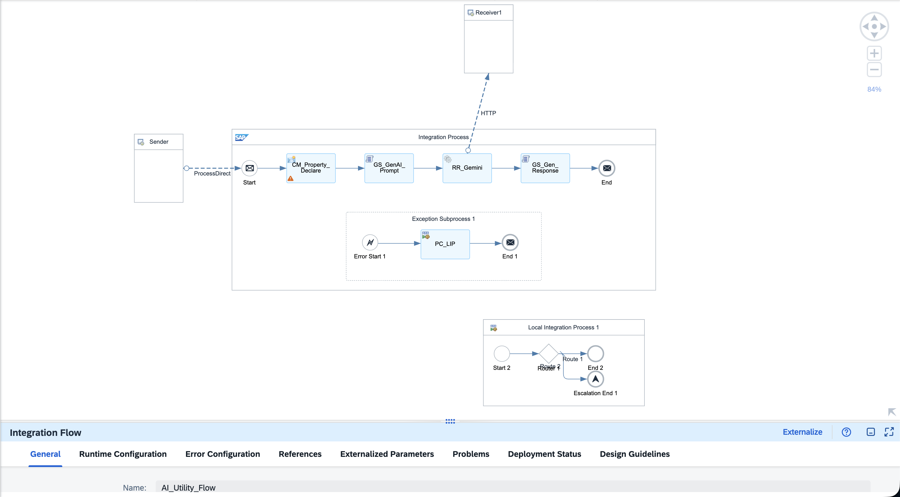

# Building the Core Interface and AI Utility Helper — Part 2

## Hey Again!

So in Part 1, I gave you the big picture about Exception Handling in SAP BTP Integration Suite. Now comes the fun part (or maybe the slightly messy part?) — actually building this thing.

I'm going to walk you through the two main integration flows: the **Exception Handling Flow** and the **AI Utility Flow**. Fair warning: I might jump around a bit because that's how these things actually get built in real life. You don't just draw a perfect diagram and ship it. You mess up, you fix stuff, you realize you forgot a header somewhere... you know how it goes.

---

## What We're Building Today

Let me list this out so we're on the same page:

- The core Interface[Main_Integration_Flow] that receives HTTP calls and writes to SFTP(Taken a simple use case for explanation focusing mainly on the Exception process)
- Exception handling that actually works (no fake promises)
- The GenAI helper that turns technical oriented messages into something your business team can read
- How to connect all these utility flows — Loggly and ServiceNow(Deep Dive of loggly and servicenow utility flows in the upcoming parts of this series.)
- The weird gotchas I ran into (so you don't have to)

Grab some coffee. Let's do this.

---

## Main Integration Flow — The Star of the Show



Okay so this is the flow that does the actual business work. It receives data via HTTPS, does some checks, and pushes the file to SFTP. Simple enough, right?

### The Entry Point — HTTPS Sender

First thing: we need a sender. I used the HTTPS adapter because to make it easy to explain the concept.  

Here's what I configured:
- **URL Path**: `/exceptionlogglyutility`
- **Authentication**: Role-based (ESBMessaging.send)
- **Maximum Body Size**: 40 MB (adjust this based on your payload size not exceeding the default value i.e 40MB)

Nothing fancy. Just a standard REST endpoint that waits for incoming requests.

### The First Step — Send to Loggly for Info Logging(This part will be explained in the next part of this series)

Wait, what? Why are we logging right away?

Well... I wanted to track every single message that comes into this flow for observability. Even the successful ones. So right after the Start event, I added a Request-Reply call to a Loggly utility flow.


This is the `RR_Logging_Info` step. It uses **ProcessDirect** adapter to call another flow:
- **Address**: `/Exception_Handling_And_Logging_Utility/Loggly_Utility`
- **Purpose**: Log successful message processing details


### The Real Business Step — Write to SFTP

After logging, the message flows to the **End** event which triggers the SFTP adapter.

Here's the SFTP config:
- **Host**: `eu-central-1.sftpcloud.io` (yours will be different obviously)
- **Directory**: `Directory` (yeah, creative name I know)
- **File Name**: `file.xml`
- **Authentication**: User credentials stored in Security Material (credential name: `SFTP_CREDENTIALS`)
- **File Exist**: Override (because sometimes you need to replace old files)

The SFTP adapter is pretty straightforward. It takes whatever payload is in the message body and writes it to the remote server.

### Exception Subprocess — Where Magic Happens


Now here's where it gets interesting. See that box at the bottom labeled "Exception Subprocess 1"? That's our safety net.

If ANY error happens in the Core Interface(SFTP connection fails, payload is wrong format, whatever), the flow immediately jumps into this subprocess. It doesn't crash. It doesn't return an HTTP 500 error to the sender. It handles it gracefully.

Inside the exception subprocess:
1. **Error Start event** catches any exception
2. **Process Call** immediately triggers a Local Integration Process
3. That local process handles all the error notification logic
4. **End event** completes the exception handling

The local process is where things get cool...

---

## Exception Handling Flow — The Error Orchestrator



Okay, so when the main flow crashes (SFTP fails, timeout, whatever), the Exception Handling flow takes over. This is a separate dedicated flow that gets called via ProcessDirect.

**Address**: `/AI_Exception_Loggly_Accelerator/Exception_Handling_Flow/`

This flow has one job: take the raw error and route it to three places in a specific order. Let me show you why the order matters.

### The Sequential Chain

Here's the flow structure:

```
Start → RR_AI_Utility → CM_Assign_Payload → RR_ServiceNow_Utility → CM_Assign_Payload → RR_Loggly_Utility → End
```

Wait, what? Three sequential calls? Yeah, I know what you're thinking... "why not parallel multicast?"

Good question. Here's why I went sequential:

### Step 1: Call AI Utility First

**Service Task**: `RR_AI_Utility`

```xml
<Address>/AI_Exception_Loggly_Accelerator/AI_Utility_Flow/</Address>
```

**Why first?** Because the AI utility takes the raw exception message and converts it into:
- A human-friendly error message
- Possible reasons (that actually make sense)
- Troubleshooting steps
- An appropriate HTTP code

This **enriched payload** is what we send to ServiceNow and Loggly. If we called them in parallel, they'd only get the raw "Cannot connect to sap-sftp://..." error, which is... not helpful.

**What goes in:**
Raw exception from the main flow (could be anything)

**What comes out:**
A beautiful JSON structure with three sections: `errorDetails`, `serviceNow`, and `loggly`

### Step 2: Content Modifier — Save the Enriched Payload

**Content Modifier**: `CM_Assign_Payload`

```xml
<Property>
  <Name>originalPayload</Name>
  <Type>expression</Type>
  <Value>${in.body}</Value>
</Property>
```

This stores the AI-enhanced payload in a property called `originalPayload`. Why? Because the next call (ServiceNow) might modify the body, and we need the full structure for Loggly too(Hope you don't forget to delete the headers and properties from time-to-time as appropriate)

### Step 3: Call ServiceNow Utility

**Service Task**: `RR_ServiceNow_Utility`

```xml
<Address>/AI_Exception_Loggly_Accelerator/Service_Now_Utility_Flow/</Address>
```

This creates a ServiceNow incident ticket with:
- Short description from AI's "customError"
- Full description with stacktrace
- Auto-assigned to the integration team
- Proper urgency/impact settings

ServiceNow utility extracts just the `serviceNow` section from the JSON and maps it to their API fields.

### Step 4: Content Modifier — Set Log Level

**Content Modifier**: `CM_Assign_Payload` (again)

This one's simpler:

```xml
<Property>
  <Name>logLevel</Name>
  <Type>constant</Type>
  <Value>ERROR</Value>
</Property>
```

And it restores the original payload:

```xml
<Body>
  <Type>expression</Type>
  <Value>${property.originalPayload}</Value>
</Body>
```

Sets the log level to ERROR so the Loggly utility knows this isn't just an info message (remember, the same Loggly flow handles both INFO and ERROR logs).

### Step 5: Call Loggly Utility

**Service Task**: `RR_Loggly_Utility`

```xml
<Address>/AI_Exception_Loggly_Accelerator/Loggly_Utility_Flow/</Address>
```

Sends the full enriched payload to Loggly for centralized logging with:
- Searchable error tags
- Structured JSON (the `loggly` section)
- Timestamp and correlation IDs

### Step 6: End

Normal End event. The exception has been:
- ✅ Enriched by AI
- ✅ Logged to ServiceNow (ticket created)
- ✅ Logged to Loggly (searchable)

### Exception Subprocess in Exception Handling Flow

Yeah, even the exception handler has an exception handler. Inception stuff.

If ANY of these three calls fail, there's an Exception Subprocess with a Local Integration Process that does... well, currently it just has a router with a disabled escalate route (condition `1=2`).

Why keep it? Future-proofing. If we ever need special handling for "exception handler failures," the structure is there.

---

### Why Sequential Instead of Parallel?

You might be wondering: "Couldn't you call all three in parallel multicast?"

Technically yes, but here's the problem:

**The Issue:**
- AI Utility takes 2-5 seconds (Gemini API call with pre-classification context)
- Conscious about tenant resource consumption and potential performance impact. 
- If ServiceNow and Loggly run in parallel with AI, they get the raw error BEFORE AI enriches it
- Result: Useless tickets saying "Cannot connect to sap-sftp://dasfasdf@eu-central-1.sftpcloud.i:22"


**The Solution:**
- AI runs first (takes 2-5 sec)
- ServiceNow and Loggly get the enriched payload (instant)
- Total time: ~5-7 seconds total

**Could you do AI first, then parallel multicast for ServiceNow + Loggly?**

Sure! But in testing, the sequential flow was simpler and more predictable.

Plus, if ServiceNow fails, we still want Loggly to log it. Sequential gives us that control.

---

## AI Utility Flow — The Smart One



Alright, this flow is where the AI magic happens. It receives error details and uses Google Gemini(Can be any LLM of your preference) to rewrite them in plain English.

The beauty of this approach: **we just send the raw error to Gemini and let it figure everything out**. No complex pattern matching, no hardcoded responses.

### The Sender — ProcessDirect

This flow starts with a ProcessDirect sender:
- **Address**: `/AI_Exception_Loggly_Accelerator/AI_Utility_Flow/`

It's basically sitting there waiting for the Exception Handling flow to call it with error details.

### Content Modifier — Setting Up Properties

**Content Modifier**: `CM_Property_Declare`

This Content Modifier is HUGE because it's preparing everything we need for the AI call. Let me break down the key properties:

#### 1. GenAlPrompt (The Base Template)

This is the AI prompt template in JSON format:

```json
{
  "contents": [
    {
      "parts": [
        {
          "text": "You are an SAP Integration consultant skilled in troubleshooting in SAP Cloud Integration (CPI)..."
        }
      ]
    }
  ]
}
```

This tells Gemini:
- You're an SAP integration expert
- Explain the error in specific sections (Custom Error, Possible Reasons, Solutions, HTTP Code, Impact, Urgency)
- Assess the severity and assign appropriate impact/urgency levels
- Keep it professional and clear

#### 2. Capture Keywords

Used to parse the AI response:
- `CaptureCustomError`: "Custom Error Message:"
- `CaptureHTTPCode`: "HTTP Response:"
- `CapturePossibleSolution`: "Possible Steps to Resolve the Error:"
- `CapturePossibleReason`: "Possible Reasons for the Error:"
- `CaptureImpact`: "Impact:"
- `CaptureUrgency`: "Urgency:"

#### 3. XPath Extraction Properties

Pull values from the incoming XML:
- `IFlow_Name`: `//IFlow_Name`
- `Message_ID`: `//Message_ID`
- `Exception_Message`: `//Exception_Message`

#### 4. Headers

- `ErrorAttachment`: Captures the full stack trace
- `X-goog-api-key`: Your Google API key (use secure parameters in production!)

### The Processing Flow — Breaking It Into Steps

Instead of cramming everything into one massive Groovy script, we break the AI processing into logical, debuggable steps. This makes it WAY easier to troubleshoot when things go wrong (and they will).

**The Flow:**
```
CM_Property_Declare(Conten Modifier) → GS_GenAI_Prompt(Groovy Script) → HTTP Adapter → GS_Gen_Response(Groovy Script) → End
```

**Why split it up?** Because each step has a clear responsibility:
1. **CM_Property_Declare**: Set up properties and headers
2. **GS_GenAI_Prompt**: Build the Gemini prompt
3. **HTTP Adapter**: Call Gemini API (with timeout/retry handling)
4. **GS_Gen_Response**: Parse response and build universal JSON

If something breaks, you know exactly which step failed. Plus, you can see the actual request/response in message monitoring.

#### Step 1: Groovy Script — `GS_Set_GenAI_Prompt`

This script takes the error from `Exception_Message` property and inserts it into the Gemini prompt template:

```groovy
import com.sap.gateway.ip.core.customdev.util.Message

def Message processData(Message message) {
    // Get the error and prompt template
    def exceptionMessage = message.getProperty("Exception_Message")
    def genAIPrompt = message.getProperty("GenAIPrompt")
    def startPrompt = message.getProperty("StartPrompt")
    
    // Find where to insert the error in the template
    def startIndex = genAIPrompt.indexOf(startPrompt)
    if (startIndex != -1) {
        // Insert the error after the StartPrompt marker
        def updatedPrompt = genAIPrompt.substring(0, startIndex + startPrompt.length()) +
                           " " + exceptionMessage +
                           genAIPrompt.substring(startIndex + startPrompt.length())
        
        message.setBody(updatedPrompt)
    }
    
    return message
}
```

**What this does:**
- Grabs the raw exception from `Exception_Message` property (extracted via XPath from incoming XML)
- Finds the insertion point in the template (where `StartPrompt` is)
- Inserts the error message into the template
- Sets the complete JSON request as the message body

**Output:** A JSON payload ready to send to Gemini API

#### Step 2: HTTP Adapter — `RR_Call_Gemini_API`

This is a standard HTTP Request-Reply adapter:

**Configuration:**
- **URL**: `https://generativelanguage.googleapis.com/v1beta/models/gemini-2.0-flash:generateContent`
- **Method**: POST
- **Query Parameters**: `key=${header.X-goog-api-key}` (API key from Content Modifier)
- **Headers**: 
  - `Content-Type: application/json`
- **Timeout**: 60 seconds
- **Address**: Uses HTTP receiver adapter

**Why separate HTTP adapter?**
- If Gemini is down or times out, the adapter handles it gracefully
- You can configure retries and error handling separately
- Easy to see the actual HTTP request/response in traces
- No need to write HTTP connection code in Groovy

#### Step 3: Groovy Script — `GS_Capture_GenAI_Response`

This script parses Gemini's response and builds the universal JSON payload:

```groovy
import com.sap.gateway.ip.core.customdev.util.Message
import groovy.json.JsonSlurper
import groovy.json.JsonOutput

def Message processData(Message message) {
    // Get capture keywords from properties
    def captureCustomErrorKey = message.getProperty("CaptureCustomError")
    def capturePossibleReasonKey = message.getProperty("CapturePossibleReason")
    def capturePossibleSolutionKey = message.getProperty("CapturePossibleSolution")
    def captureHTTPCodeKey = message.getProperty("CaptureHTTPCode")
    def captureImpactKey = message.getProperty("CaptureImpact")
    def captureUrgencyKey = message.getProperty("CaptureUrgency")
    
    // Parse Gemini's JSON response
    def payload = message.getBody(String)
    def jsonSlurper = new JsonSlurper()
    def parsedJson = jsonSlurper.parseText(payload)
    
    // Extract the AI's text from the response
    def textContent = parsedJson.candidates[0]?.content?.parts[0]?.text
    
    // Extract each section using the capture keywords
    def customError = extractValueAfter(textContent, captureCustomErrorKey)
    def possibleReason = extractValueAfter(textContent, capturePossibleReasonKey)
    def possibleSolution = extractValueAfter(textContent, capturePossibleSolutionKey)
    def httpCode = extractHTTPCode(textContent, captureHTTPCodeKey)
    def impact = extractValueAfter(textContent, captureImpactKey)
    def urgency = extractValueAfter(textContent, captureUrgencyKey)
    
    // Build the universal JSON payload
    def universalPayload = [
        errorDetails: [
            systemError: message.getProperty("Exception_Message"),
            customError: customError,
            possibleReason: possibleReason,
            possibleSolution: possibleSolution,
            httpCode: httpCode,
            iflowName: message.getProperty("IFlow_Name"),
            messageId: message.getProperty("Message_ID")
        ],
        serviceNow: [
            shortDescription: customError,
            description: possibleReason + "\n\n" + possibleSolution,
            impact: impact,
            urgency: urgency
        ],
        loggly: [
            level: "ERROR",
            customError: customError,
            systemError: message.getProperty("Exception_Message")
        ]
    ]
    
    message.setBody(JsonOutput.toJson(universalPayload))
    return message
}

// Helper function to extract values
def extractValueAfter(String text, String key) {
    def idx = text.indexOf(key)
    if (idx == -1) return "Unknown"
    def start = idx + key.length()
    def end = text.indexOf("\n\n", start)
    return text.substring(start, end).trim()
}

def extractHTTPCode(String text, String key) {
    def value = extractValueAfter(text, key)
    def matcher = value =~ /\b(4\d{2}|5\d{2})\b/
    return matcher ? matcher[0] : "500"
}
```

**What this does:**
- Parses Gemini's JSON response structure
- Extracts the text from `candidates[0].content.parts[0].text`
- Uses string parsing to find each section (Custom Error, Possible Reasons, Solutions, HTTP Code, Impact, Urgency)
- Gemini determines impact and urgency based on error severity
- Builds the universal JSON with `errorDetails`, `serviceNow`, and `loggly` sections

**Output:** The universal JSON payload that Exception Handling flow expects

#### Why This Multi-Step Approach Works

**Debugging is easier:**
- After Groovy Script 1: See the exact request being sent to Gemini
- After HTTP Adapter: See Gemini's raw response (or the error if it failed)
- After Groovy Script 2: See the final universal JSON

**Flexibility:**
- Want to switch from Gemini to GPT-4? Just change Content Modifier (URL, API key) and Groovy Script 1 (prompt format)
- Want to add request logging? Add a Content Modifier between steps
- Want retry logic? Configure it in the HTTP adapter

**Each script is small:**
- Groovy Script 1: ~20 lines (just string manipulation)
- Groovy Script 2: ~40 lines (JSON parsing and payload building)
- Way easier to maintain than one 200-line script

#### The Universal JSON Payload

After Groovy Script 2, here's what the payload looks like:
        systemError: camelExceptionCaught,
        customError: customError,
        possibleReason: possibleReason,
        possibleSolution: possibleSolution,
        httpCode: httpCode,
        iflowName: IFlow_Name,
        messageId: Message_ID
    ],
    serviceNow: [
        shortDescription: customError,
        description: possibleReason + "\n\n" + possibleSolution,
        impact: "3-Low",
        urgency: "3-Low"
    ],
    loggly: [
        level: "ERROR",
        customError: customError,
        systemError: camelExceptionCaught
    ]
]

message.setBody(JsonOutput.toJson(universalPayload))
```

**Why keep it in one script?** Debugging. If the script fails, you can see exactly where it failed (prompt building, API call, parsing, or payload generation) in the stack trace.

#### The Universal Payload

Once we have the AI-enriched error from Gemini, the script builds this beautiful JSON:

```json
{
  "errorDetails": {
    "systemError": "Cannot connect to sap-sftp://...",
    "customError": "Failed to connect to SFTP server",
    "possibleReason": "Invalid hostname or credentials; Port 22 blocked...",
    "possibleSolution": "Verify hostname in adapter; Check Cloud Connector...",
    "httpCode": "502",
    "iflowName": "Main_Integration_Flow",
    "messageId": "AGltBrlObryUzYIA9n8yOfzuRf1A"
  },
  "serviceNow": {
    "shortDescription": "Failed to connect to SFTP server",
    "description": "Full error details...",
    "impact": "2-Medium",
    "urgency": "2-Medium"
  },
  "loggly": {
    "level": "ERROR",
    "systemError": "Cannot connect to...",
    "customError": "Failed to connect to SFTP server",
    "timestamp": "2026-01-18T16:13:50.234Z"
  }
}
```

Notice how **ONE payload** contains sections for BOTH ServiceNow AND Loggly? That's intentional. The downstream utility flows just extract what they need.

### End Event

After the Groovy script finishes, the flow:
- Sets the enriched JSON as the message body
- Sets `Content-Type: application/json`
- Returns to the Exception Handling flow

The Exception Handling flow then:
- Calls ServiceNow utility with this payload
- Calls Loggly utility with this payload
- Both extract what they need from the universal JSON

### Exception Handling in the AI Flow

See that exception subprocess at the bottom? It's pretty simple:

```
Error Start Event → Process Call (Local Integration Process) → End Event
```

Inside the Local Integration Process:

```
Start → Router → [Route 1: End] or [Route 2: Escalate End]
```

Wait, a router that does nothing? The escalate route has condition `1=2` (always false), so it never escalates.

**Why keep it?** Future-proofing. If we ever need to log AI failures separately or add retry logic, the structure is already there.

Right now, any AI failure just ends normally. The Exception Handling flow's own exception subprocess would catch if the AI utility call itself fails (network timeout, etc.).

---

## How These Flows Work Together

Let me paint the full picture with the actual architecture:

### Happy Path (No Errors)

1. HTTP request comes in to Main Integration Flow
2. Main flow writes file to SFTP
3. Main flow returns HTTP 200 to sender
4. Done!

### Error Path (Error Occurs)

Here's where it gets interesting:

1. **HTTP request comes in** to Main Integration Flow
2. **Main flow tries to write to SFTP but fails** (wrong hostname, network issue, whatever)
3. **Main flow's Exception Subprocess catches the error**
4. **Exception Subprocess(in Main_Flow) calls Exception Handling Flow** via ProcessDirect
5. **Exception Handling Flow - Step 1: Call AI Utility**
   - AI Utility receives raw exception message from the XML payload
   - Content Modifier extracts error details via XPath (`Exception_Message`, `IFlow_Name`, `Message_ID`)
   - Groovy Script 1 builds the Gemini prompt with error details
   - Returns enriched JSON in 2-5 seconds
   - JSON contains: `errorDetails`, `serviceNow`, and `loggly` sections
6. **Exception Handling Flow - Step 2: Content Modifier**
   - Stores enriched payload in `originalPayload` property
7. **Exception Handling Flow - Step 3: Call ServiceNow Utility**
   - ServiceNow extracts `serviceNow` section from JSON
   - Creates incident ticket with human-friendly description
   - Returns successfully
8. **Exception Handling Flow - Step 4: Content Modifier**
   - Sets `logLevel=ERROR` property
   - Restores original enriched payload to body
9. **Exception Handling Flow - Step 5: Call Loggly Utility**
   - Loggly extracts `loggly` section from JSON
   - Sends structured log to Loggly HTTP endpoint
   - Returns successfully
10. **Exception Handling Flow ends**
11. **Control returns to Main Flow's Exception Subprocess**
12. **Main flow returns HTTP 500 Internal Server Error** 


**Total time for error handling: ~5-7 seconds** (AI processing is the main bottleneck)

---

## The Things Nobody Tells You (But I Will)

### 1. Why Sequential Calls in Exception Handling Flow?

I tried parallel multicast first. It was a disaster:
- ServiceNow got raw error → useless ticket saying "Cannot connect to sap-sftp://..."
- Potential performance hit and memory consumption. 
- Loggly got raw error → unsearchable logs with no context
- AI enrichment happened too late

Sequential flow ensures:
1. AI enriches error FIRST (2-5 seconds for Gemini processing)
2. ServiceNow and Loggly get the human-friendly version
3. Total time: ~5-7 seconds, which is acceptable for error handling

### 2. The Structured Prompt Makes Gemini Responses Consistent

The key to getting good results from Gemini is **how you ask**. The Groovy script uses a structured prompt that tells Gemini:
- What role to play ("You are an SAP Integration consultant...")
- What information it has (Message ID, iFlow name, error message, stack trace)
- Exactly what format to return the response in (Custom Error Message, Possible Reasons, Possible Solutions, HTTP Code)

**The benefit:**
- Every error gets analyzed by Gemini with the same prompt structure
- Responses are consistent and predictable
- Easy to parse because Gemini follows the format we specified
- No hardcoded logic means Gemini can handle ANY error type
- Gemini dynamically determines impact and urgency based on error severity (not hardcoded)

This makes the solution production-ready because you're not maintaining lists of error patterns. Gemini adapts to whatever errors your integration throws.

### 3. The Universal Payload Structure is Key

Having ONE JSON structure that serves both ServiceNow AND Loggly simplifies everything:
- One Groovy script to maintain
- One payload format to document
- Easy to add more destinations later (Splunk? Email? Slack?)

Just make sure your utility flows know how to extract their section:
- ServiceNow extracts: `${body.serviceNow}`
- Loggly extracts: `${body.loggly}`

### 4. ProcessDirect Addresses Must Match Exactly

I wasted like 30 minutes debugging why my flows wouldn't connect. Turns out I had a trailing slash in one place and not in another. Be consistent:
- GOOD: `/Exception_Handling_And_Logging_Utility/Gen_AI_Utilty_Flow/`
- BAD: `/Exception_Handling_And_Logging_Utility/Gen_AI_Utilty_Flow`

Actually, both work if you're consistent. Just pick one style.

### 5. Escalate End Events Are Your Safety Net

Here's something I wish someone had told me earlier: **use Escalate End Events in your utility flows** (AI Utility, ServiceNow, Loggly).

Without Escalate End:
- If ServiceNow utility fails, the entire Exception Handling flow crashes
- The main flow gets stuck waiting
- Your sender gets a timeout error

**With Escalate End:**
- If ServiceNow utility fails → Escalate End catches it
- Exception Handling flow continues to call Loggly
- Main flow completes normally

**Where I added them:**
- ✅ AI Utility Flow: Exception subprocess with Escalate End (if Gemini API fails)
- ✅ ServiceNow Utility Flow: Exception subprocess with Escalate End (if ServiceNow is down)
- ✅ Loggly Utility Flow: Exception subprocess with Escalate End (if Loggly endpoint fails)
- ❌ Main Integration Flow: Regular End Event (because we WANT the exception to trigger the Exception Handling flow)

**The pattern:**
```
Exception Subprocess:
  Error Start Event → Process Call (Local Integration Process) → Escalate End Event
```

This ensures that even if your error handling fails, the main business flow isn't blocked. You'll log what you can, and move on.

### 6. Exception Subprocesses Need Error Start Events

You can't just draw a box and call it an exception handler. Inside the subprocess, you MUST have an Error Start event. Otherwise it never triggers.

### 7. Local Integration Processes Are Not the Same as Subprocesses

- **Subprocess**: Part of the same transaction, runs inline
- **Local Integration Process**: Separate process definition, can be called from multiple places

I use local processes for the exception logic because I might want to call the same error handling from multiple main flows.

### 8. XPath Expressions Need Correct Namespaces

When extracting values with XPath (`//IFlow_Name`), make sure your XML actually has those elements. If your XML uses namespaces, you need to declare them in the flow properties.

In my case, the XML is simple with no namespaces, so basic XPath works fine.

### 5. Testing Is Annoying

How do you test exception handling? You have to make things fail on purpose:
- Wrong SFTP credentials
- Invalid hostname
- Malformed payload

Create test scenarios for each failure mode. Trust me, your future self will thank you.

---

## What About Those Other Utility Flows?

You might be wondering: "Okay cool, but what about the actual Loggly flow? The ServiceNow flow?"

Good question! Those are separate integration flows that I'll cover in Part 3. Each one has its own adapter configuration:

- **Loggly**: Uses HTTP adapter to POST JSON to Loggly's HTTP endpoint
- **ServiceNow**: Uses OData or REST adapter to create incidents via ServiceNow API

I kept them separate so this post doesn't turn into a novel. (Too late?)

---

## Configuration Tips That Will Save Your Life

### Use Security Materials

Never hardcode passwords or API keys directly in the flow. Use:
- **Secure Parameters** for API keys
- **Security Material** (User Credentials) for username/password pairs

In the SFTP adapter, I reference `SFTP_CREDENTIALS` which is stored in Security Material.

### Externalize Everything You Can

Use externalized parameters for:
- Endpoint URLs
- File paths
- Timeout values
- Retry counts

This makes it easier to move between DEV, TEST, and PROD without changing the flow.

### Log Early, Log Often

Add trace/log steps at key points:
- Start of flow
- Before external calls
- After transformations
- In exception handlers

When things go wrong (and they will), those logs are your best friend.

### Name Things Clearly

I could have called that Content Modifier "CM_1" but instead I used "CM_Payload". Future me won't have to guess what it does.

Same with the ProcessDirect addresses. Use paths that make sense:
- `/Exception_Handling_And_Logging_Utility/Gen_AI_Utilty_Flow/`

vs

- `/flow1/process2/helper3/`

Which one would you rather debug at 2 AM?

---

## Testing the Main Flow

Here's how I tested this:

### Test 1: Happy Path

1. Use Postman to POST a valid XML payload to the HTTP endpoint
2. Check SFTP server — file should appear
3. Check Loggly — should see info-level log entry
4. HTTP response should be 200 OK

### Test 2: SFTP Failure

1. Change SFTP credentials to something invalid
2. POST the same payload
3. HTTP response should still be 200 (because we handled it)
4. Check that GenAI flow was triggered
5. Check ServiceNow for incident ticket
6. Check Loggly for formatted error message

### Test 3: GenAI Flow Failure

This one's tricky. How do you make the AI fail?
- Invalid API key
- Malformed JSON
- Network timeout

When it fails, the GenAI flow's own exception subprocess should catch it and log to Loggly.

---

## Common Issues I Ran Into

### Issue 1: Exception Subprocess Not Triggering

**Problem**: Error occurred but the exception subprocess didn't run.

**Solution**: The subprocess needs to be at the same level as the main flow steps. Don't nest it inside another subprocess.

### Issue 2: ProcessDirect "Address Not Found"

**Problem**: Main flow couldn't call GenAI flow.

**Solution**: Make sure:
- GenAI flow is deployed
- ProcessDirect address matches exactly
- Both flows are in the same integration package (or use cross-package calls properly)

### Issue 3: XML Parsing Errors

**Problem**: XPath expressions in Content Modifier returned empty values.

**Solution**: 
- Validate XML structure matches what you expect
- Test XPath in an XML editor first
- Use `trace` to see the actual message content at that point

### Issue 4: Sequential Calls Timing Out

**Problem**: One of the three sequential calls (AI/ServiceNow/Loggly) took too long.

**Solution**: 
- Increase timeout in each ProcessDirect adapter (default 60 seconds should be fine)
- Check which step is slow (add trace logs)
- If AI Utility is slow, verify Gemini API key and network
- If ServiceNow is slow, check their API performance
- If Loggly is slow, check HTTP endpoint connectivity

### Issue 5: Gemini Response Parsing Errors

**Problem**: The Groovy script can't parse Gemini's response correctly.

**Solution**:
- Check the actual Gemini response in the message logs
- Make sure Gemini is following the format you specified in the prompt
- If Gemini's format changed, update the parsing logic in the Groovy script
- The script looks for specific keywords like "Custom Error Message:" and "Possible Reasons:"
- If needed, make the prompt more explicit: "You MUST use this exact format..."

---

## Verifying Successful Execution

Once you've built and tested everything, here's how to verify the flows are running correctly using the monitoring traces:

### Exception Handling Flow Trace


This trace shows the sequential execution:
1. AI Utility call completed
2. Content Modifier stored the enriched payload
3. ServiceNow Utility call succeeded
4. Content Modifier set log level to ERROR
5. Loggly Utility call logged the enriched error


---

## What's Next?

In Part 3, I'll dive deep into:

- **ServiceNow Utility Flow**: How to extract the serviceNow section and create incident tickets with human-friendly descriptions
- **Loggly Utility Flow**: How the unified flow handles both INFO and ERROR logs
- **Testing the entire setup**: Using Postman to trigger errors and verify the traces
- **Viewing the execution traces**: What to look for in monitoring to confirm everything works
- **Simulating failures**: Making things break on purpose to test your safety nets
- **Final checklist**: Everything you need before going live

---

## Final Thoughts

Building exception handling that actually works is not glamorous. It's not the fun part of integration. But when it's 3 AM and something breaks in production, you'll be SO GLAD you did this properly.

The main flow keeps doing business work. The GenAI flow makes errors understandable. The utility flows notify the right people. And most importantly, the sender system doesn't get a cryptic HTTP 500 error.

Is this perfect? No. Could it be simpler? Maybe. But it works, it's maintainable, and it saved my team countless hours of "what does this error mean?" conversations.

Now go build something that fails gracefully. Your future self will thank you.

---

Stay tuned for Part 3 where we get into the nitty-gritty details of each utility flow and the Groovy scripts!

*Questions? Hit me up in the comments. I'll try to respond when I'm not debugging integration flows at midnight.*
