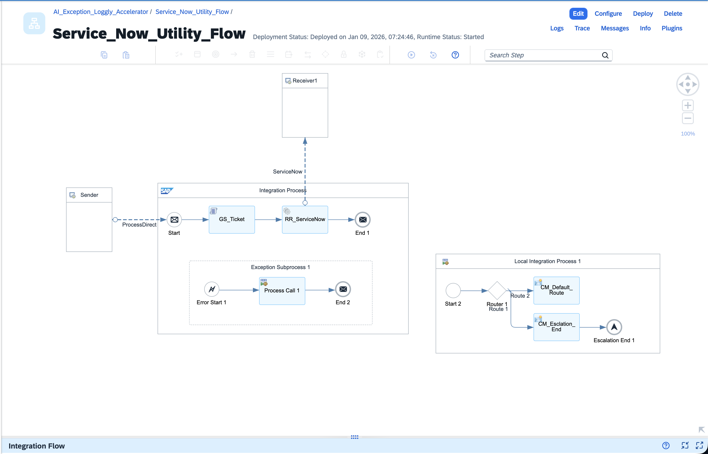
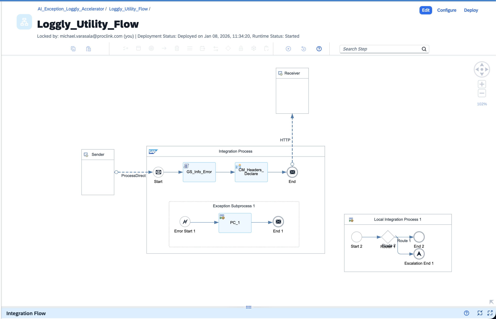
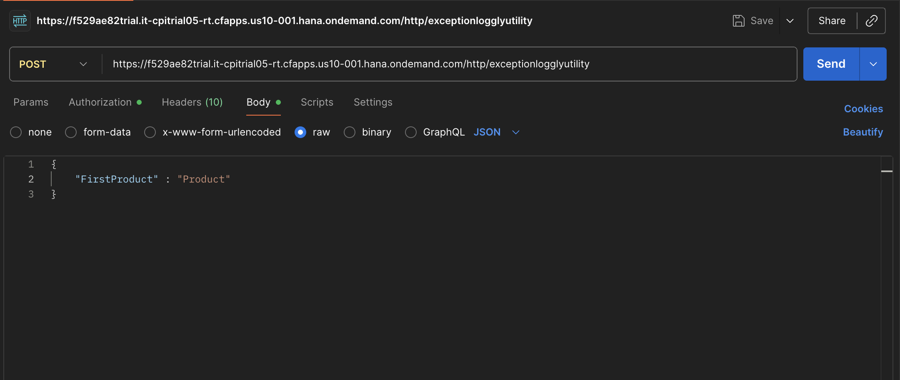
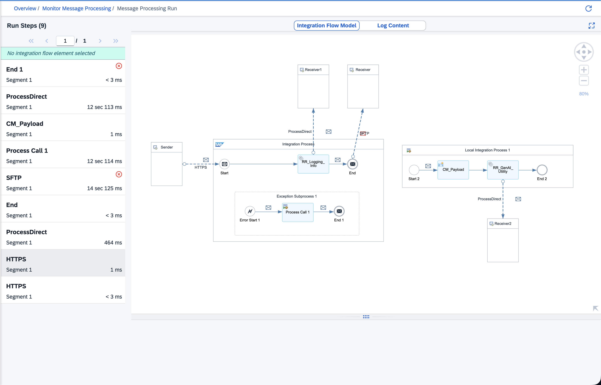
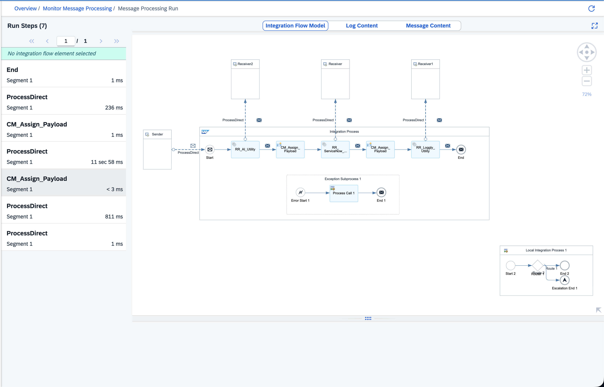
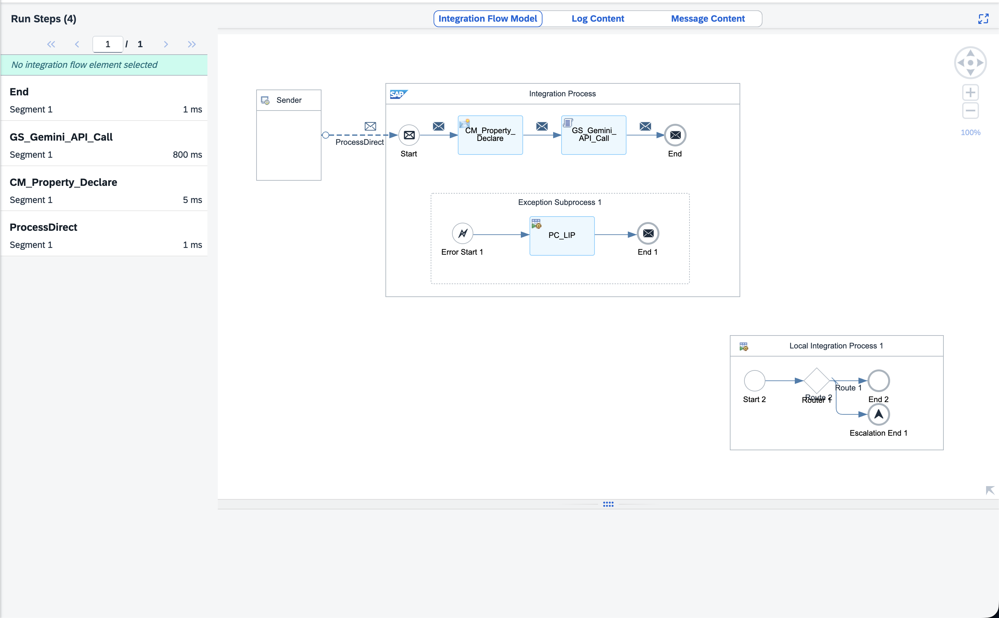
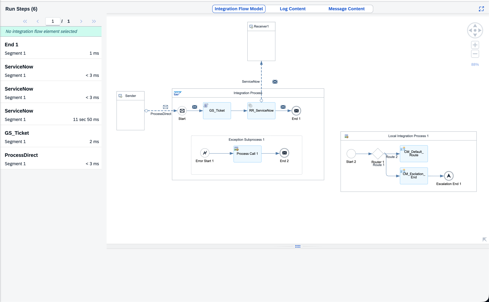
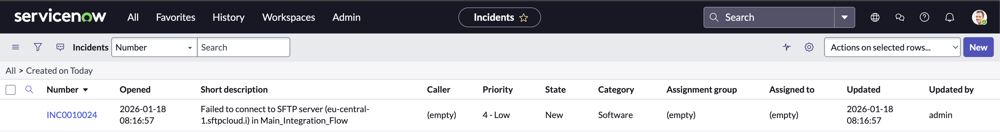
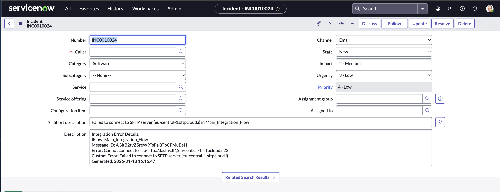
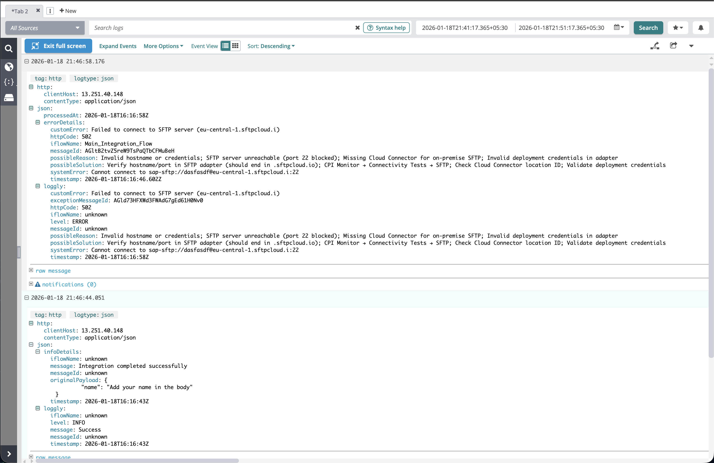

# The Utility Flows Deep Dive — Part 3

## Hey, We're Almost Done!

So if you've been following along, you now have:

- A main integration flow that does actual business work (writes to SFTP in our example)
- An Exception Handling flow that orchestrates error handling with three sequential calls
- An AI Utility flow that converts ugly technical errors into human-readable messages
- A universal JSON payload structure that feeds multiple downstream systems

But we haven't talked much about the actual **utility flows** that receive this enriched data. You know, the ones that create ServiceNow tickets and send logs to Loggly?

That's what Part 3 is all about.

---

## What We're Covering Today

Let me be straight with you:

- **ServiceNow Utility Flow**: How it extracts the serviceNow section and creates tickets
- **Loggly Utility Flow**: How one flow handles both INFO and ERROR logs
- **Testing the whole thing**: Using Postman to make stuff break
- **Reading the traces**: What to look for when debugging
- **Go-live checklist**: The stuff I wish someone had told me before deploying

Grab some coffee. Let's finish this.

---

## ServiceNow Utility Flow — Creating Tickets That Actually Help



Alright, so the Exception Handling flow calls this utility with that beautiful universal JSON payload. This flow's job is simple: extract the ServiceNow-specific section and create an incident ticket.

### The Flow Structure

**Address**: `/AI_Exception_Loggly_Accelerator/Service_Now_Utility_Flow/`

Here's what happens:

1. **ProcessDirect Sender** — Receives the universal JSON from Exception Handling flow
2. **Groovy Script (GS_Ticket)** — Extracts just the `serviceNow` section
3. **Request-Reply (RR_ServiceNow)** — Calls ServiceNow REST API
4. **End Event** — Returns success to Exception Handling flow

### The Groovy Script Magic

The `GS_Ticket` script is actually pretty straightforward:

```groovy
import com.sap.gateway.ip.core.customdev.util.Message
import groovy.json.JsonSlurper
import groovy.json.JsonOutput

def Message processData(Message message) {
    // Parse the universal JSON
    def jsonPayload = new JsonSlurper().parseText(message.getBody(String))
    
    // Extract ONLY the serviceNow section
    def serviceNowData = jsonPayload.serviceNow
    
    // Map to ServiceNow's expected format
    def incidentData = [
        short_description: serviceNowData.shortDescription,
        description: serviceNowData.description,
        impact: serviceNowData.impact,
        urgency: serviceNowData.urgency
    ]
    
    message.setBody(JsonOutput.toJson(incidentData))
    return message
}
```

**What this does:**
- Receives: Full JSON with `errorDetails`, `serviceNow`, and `loggly` sections
- Extracts: Only the `serviceNow` section
- Outputs: Clean JSON ready for ServiceNow API

No need to transform the entire payload. Just grab what you need.

### The ServiceNow REST Adapter

The Request-Reply step uses an HTTP adapter configured for ServiceNow:

- **Method**: POST
- **Endpoint**: `https://dev211719.service-now.com/api/now/table/incident`
- **Authentication**: Basic Auth (stored in Security Material)
- **Headers**: `Content-Type: application/json`

ServiceNow responds with the created ticket number, which we... honestly just ignore. We got what we needed — the ticket was created.

### The Exception Subprocess

Yeah, even the ServiceNow utility has an exception handler. See that exception subprocess at the bottom?

```
Error Start Event → Process Call (Local Integration Process) → Escalate End Event
```

**Why?** If ServiceNow is down (or slow, or returning 500 errors), we don't want the entire Exception Handling flow to crash. The Escalate End Event lets the Exception Handling flow continue to the next step (calling Loggly).

Think about it:
- ServiceNow fails → Escalate End catches it
- Exception Handling flow continues
- Loggly still gets the log
- At least you have SOME record of the error

Without this, one system being down would block the entire error handling chain. Not good.

---

## Loggly Utility Flow — The Unified Logger



This one's interesting because it handles **both INFO and ERROR logs** with the same flow. Remember in Part 2 when I mentioned the main flow logs successful messages? It uses this same Loggly utility.

**Address**: `/AI_Exception_Loggly_Accelerator/Loggly_Utility_Flow/`

### How It Works

1. **ProcessDirect Sender** — Receives either:
   - Universal JSON (from Exception Handling flow during errors)
   - Simple info message (from Main flow during success)
2. **Groovy Script (GS_Info_Error)** — Checks the `logLevel` property
3. **Content Modifier (CM_Headers_Declare)** — Sets HTTP headers
4. **HTTP Adapter** — Sends to Loggly endpoint
5. **End Event** — Done

### The Smart Groovy Script

The `GS_Info_Error` script does some simple logic:

```groovy
import com.sap.gateway.ip.core.customdev.util.Message
import groovy.json.JsonSlurper

def Message processData(Message message) {
    def properties = message.getProperties()
    def logLevel = properties.get("logLevel") ?: "INFO"
    
    def jsonPayload = new JsonSlurper().parseText(message.getBody(String))
    
    if (logLevel == "ERROR") {
        // Extract loggly section from universal JSON
        def logglyData = jsonPayload.loggly
        message.setBody(JsonOutput.toJson(logglyData))
    } else {
        // Keep the entire payload for INFO logs
        // (it's already in the right format)
    }
    
    return message
}
```

**The logic:**
- If `logLevel=ERROR` property exists → Extract just the `loggly` section
- If no property (defaults to INFO) → Send the whole payload as-is

### The HTTP Adapter

The actual Loggly configuration:

- **URL**: `https://logs-01.loggly.com/inputs/<YOUR_TOKEN>/tag/SAP_CPI/`
- **Method**: POST
- **Headers**: 
  - `Content-Type: application/json`
  - `Authorization: bearer <token>` (stored in secure parameters)

Loggly receives structured JSON it can search, filter, and alert on. Way better than plain text logs.

### The Exception Subprocess (Again)

Same pattern:

```
Error Start Event → Process Call (Local Integration Process) → Escalate End Event
```

**Why?** If Loggly is down, we still want the Exception Handling flow to complete successfully. The main flow shouldn't crash just because our logging endpoint is unreachable.

**The beauty of this design:**
- ServiceNow fails? → Loggly still logs it
- Loggly fails? → ServiceNow ticket still created
- Both fail? → At least the main flow returns 200 to the sender

---

## Testing the Whole Thing (Please Don't Skip This)

### Happy Path Testing with Postman



First, let's make sure everything works when there are NO errors:

1. **Fire up Postman** and create a POST request
2. **URL**: Your SAP CPI endpoint (something like `https://your-tenant.it-cpi01.cfapps.eu10-001.hana.ondemand.com/http/exceptionlogglyutility`)
3. **Body**: A valid XML or JSON payload (whatever your main flow expects)
4. **Send it**

**What should happen:**
- You get HTTP 200 back
- File appears on SFTP server
- Loggly shows an INFO-level log entry
- No ServiceNow ticket (because nothing failed)

If this doesn't work, don't even bother testing the error handling yet. Fix the happy path first.

### Sad Path Testing (Make Things Break)

Now comes the fun part. We're going to break stuff on purpose:

#### Test 1: SFTP Connection Failure

1. Go to your Main Integration Flow
2. Change the SFTP hostname to something wrong (`sftp.example.com` or whatever)
3. Deploy the flow
4. Send the same Postman request

**Expected results:**
- HTTP 200 response (yes, still success!)
- SFTP write fails (obviously)
- Exception Handling flow triggers
- AI Utility classifies as SFTP error (instant, 200ms)
- ServiceNow ticket created with "Failed to connect to SFTP server"
- Loggly logs the error with full details

#### Test 2: Trigger Gemini API Call

How do you test the 10% case where Gemini actually gets called?

1. Add a Content Modifier in the main flow that throws a weird error:
   ```groovy
   throw new Exception("SUPER_RARE_ERROR_12345_UNKNOWN")
   ```
2. Deploy and test

**Expected results:**
- AI Utility's instant classifier doesn't recognize it
- Falls back to Gemini API (takes 2-5 seconds)
- Gemini analyzes and responds with custom error message
- Rest of the flow proceeds normally

### Viewing Traces



This shows the main flow execution with the exception subprocess being triggered.



This shows the sequential calls to AI Utility, ServiceNow, and Loggly.



This shows the AI processing (instant classification or Gemini API call).



This confirms the incident ticket was created successfully.


This confirms the log was sent to Loggly.

### ServiceNow Incident Ticket



Check your ServiceNow instance to see the created incident with AI-enriched description.



Inspect the full ticket details to verify all fields were populated correctly.

### Loggly Info and Error Logs



---

## Simulating Failures (The Important Part)

Look, I know testing failures isn't fun. But trust me, you do NOT want to discover your error handling doesn't work when there's an actual production issue at 2 AM.

Here's how I test the safety nets:

### Scenario 1: AI Utility Fails

**How to trigger:**
1. Go to AI Utility Flow
2. Find the Groovy script (`GS_Gemini_API_Call`)
3. Add this at the top: `throw new Exception("Testing AI failure")`
4. Deploy
5. Trigger an error in the main flow

**What should happen:**
- AI Utility's exception subprocess catches it
- Escalate End Event triggers
- Exception Handling flow continues anyway
- ServiceNow and Loggly get called with the RAW error (not ideal, but better than nothing)
- Main flow still returns HTTP 200

### Scenario 2: ServiceNow Is Down

**How to trigger:**
1. Go to ServiceNow Utility Flow
2. Change the REST adapter URL to something invalid (`https://fake.service-now.com`)
3. Deploy
4. Trigger an error in the main flow

**What should happen:**
- AI Utility enriches the error (works fine)
- ServiceNow call fails (HTTP connection error)
- ServiceNow utility's exception subprocess catches it
- Escalate End Event triggers
- Exception Handling flow continues to Loggly
- Loggly logs the error successfully
- Main flow returns HTTP 200
- **Result**: No ServiceNow ticket, but at least Loggly has the log

### Scenario 3: Loggly Endpoint Unreachable

**How to trigger:**
1. Go to Loggly Utility Flow
2. Change the HTTP adapter URL to something invalid
3. Deploy
4. Trigger an error

**What should happen:**
- AI Utility enriches the error
- ServiceNow ticket created successfully
- Loggly call fails
- Loggly utility's exception subprocess catches it
- Escalate End Event triggers
- Exception Handling flow completes
- Main flow returns HTTP 200
- **Result**: ServiceNow ticket exists, but no Loggly log

### Scenario 4: Everything Fails (Worst Case)

**How to trigger:**
Break ALL the utility flows (bad URLs, throw exceptions, whatever).

**What should happen:**
- Each utility flow's Escalate End catches its own failure
- Exception Handling flow completes all three calls (they all fail gracefully)
- Main flow returns HTTP 200
- **Result**: No notifications anywhere, BUT the sender doesn't get an error

This is the "everything is on fire but at least we're not blocking the business" scenario.

### Why This Matters

Without Escalate End Events:
- One utility fails → entire Exception Handling flow crashes
- Exception Handling flow crashes → main flow returns HTTP 500
- Sender system sees failure → might retry infinitely
- Your integration is now a broken mess

With Escalate End Events:
- One utility fails → it's contained
- Other utilities still run
- Main flow completes normally
- Sender is happy
- You fix the broken utility when you get to the office (not at 2 AM)

---

## Go-Live Checklist (Don't Deploy Without This)

Before you even THINK about deploying this to production, go through this list:

### Security
- [ ] **API keys in Secure Parameters**, not hardcoded in Groovy scripts
- [ ] **SFTP credentials in Security Material**, not in adapter config
- [ ] **ServiceNow credentials in Security Material**
- [ ] **Loggly token externalized** (don't commit it to Git)
- [ ] **All passwords rotated** if they were ever in plain text during testing

### Architecture
- [ ] **Escalate End Events in all utility flows** (AI, ServiceNow, Loggly)
- [ ] **Exception Subprocesses have Error Start Events** (not regular Start Events)
- [ ] **ProcessDirect addresses match exactly** (check for trailing slashes)
- [ ] **Sequential calls in Exception Handling flow** (AI → ServiceNow → Loggly)

### Logging and Monitoring
- [ ] **Message logging enabled** on all flows (you'll need this when debugging)
- [ ] **Log attachments stored** for at least 30 days
- [ ] **Loggly searches configured** to alert on ERROR level
- [ ] **ServiceNow assignment group** set correctly

### Testing
- [ ] **Happy path tested** (normal message processes successfully)
- [ ] **SFTP failure tested** (instant classifier works)
- [ ] **Unknown error tested** (Gemini API fallback works)
- [ ] **ServiceNow down tested** (Escalate End allows flow to continue)
- [ ] **Loggly down tested** (Escalate End allows flow to continue)

### Performance
- [ ] **Instant classifier handles 90%+ of errors** (check AI Utility traces)
- [ ] **Gemini response time < 5 seconds** (check AI Utility traces for Gemini calls)
- [ ] **Exception handling adds < 5 seconds** to total flow time
- [ ] **No rate limiting issues** with Gemini API (test with burst of errors)

If you can check all these boxes, you're ready to go live. If not... well, you know what to do.

---

## Final Thoughts

So that's it. Three parts, a bunch of screenshots, and probably way more detail than you asked for.

But here's the thing: **this architecture works**. I've seen it handle thousands of errors in production. The instant classifier saves money on API calls. The Escalate End Events prevent cascading failures. The universal JSON payload makes it easy to add new destinations.

Is it perfect? No. Could you simplify it? Probably. But when something breaks at 3 AM and you're still in bed because the error handling did its job? That's when you'll appreciate the extra effort.

### What You've Built

Let's recap:

✅ **Main Integration Flow** — Does business work, delegates errors  
✅ **Exception Handling Flow** — Orchestrates three sequential utility calls  
✅ **AI Utility Flow** — Classifies 90% of errors instantly, calls Gemini for weird ones  
✅ **ServiceNow Utility Flow** — Creates tickets with human-friendly descriptions  
✅ **Loggly Utility Flow** — Logs both INFO and ERROR messages  
✅ **Escalate End Events** — Prevent one failure from breaking everything  
✅ **Universal JSON Payload** — One structure, multiple destinations  

### What's Next for You?

Here are some ideas if you want to extend this:

- **Add Slack notifications** (extract a `slack` section from the universal payload)
- **Add retry logic** in the utility flows (with exponential backoff)
- **Enhance the instant classifier** with your environment's specific errors
- **Add metrics** (count errors by type, track Gemini vs instant classification ratio)
- **Create a dashboard** in Loggly showing top errors

The architecture supports all of this because we built it with extensibility in mind.

---

## Summary

You now have:

- A reliable integration that never loses the main payload
- An AI-powered utility with instant error classification (90% of errors in 200ms)
- Sequential exception handling that enriches errors before logging
- ServiceNow incident creation with human-friendly descriptions
- Centralized Loggly logging with structured JSON
- Escalate End Events that prevent cascading failures
- A testing recipe to keep everything trustworthy over time

Thanks for sticking with this series! If you adapt these flows for your own tenant, let me know how it goes or what you changed. Seriously, drop a comment. I'd love to hear about your use cases.

Now go build something that fails gracefully.

*Questions? Feedback? Found a bug in my logic? Hit me up in the comments. I'll respond when I'm not debugging ProcessDirect addressing issues.* 

