# Exception Handling In SAP BTP Integration Suite Using AI Utility Flows

**Hello everyone!** 
Recently, I worked on an SAP integration where error handling was crucial. Unexpected errors can break the entire flow or cause missed notifications. To solve this, I designed a resilient error handling framework that combines classical subprocesses and a modern AI utility flow to enrich error messages automatically. This blog will share that approach with you.

---

## 2. What You Will Learn from This Blog

- Understand synchronous vs asynchronous exception handling in SAP Integration Suite
- How to build integration flows that continue processing even if exceptions occur  
- How to use AI utilities like Gemini to generate user-friendly error messages  
- How to reliably notify systems like ServiceNow, Loggly, and via email on errors  
- Best practices for safe and scalable exception management in SAP Integration Suite

---

## 3. Synchronous vs Asynchronous Exception Handling

### Synchronous Integrations

- **Sender Adapter:** IDOC, HTTP  
- **Receiver Adapter:** SFTP  
- **Key requirement:** An error in the integration flow must **not affect** message delivery to SFTP.  

To achieve this:  
Use **Escalation End** events in subprocess utilities—so if exceptions occur, the main process continues and error handling or alerting steps trigger without blocking.

**Example:**  
Main Integration: HTTP → RequestReply for connectivity → SFTP placing if no error.  
If an error occurs, a GenAI-powered subprocess creates smart error responses and uses escalation ends.

### Asynchronous Integrations

- **Sender Adapter:** IDOC, HTTP  
- **Receiver Adapter:** SFTP  
- **Key requirement:** Message delivery runs independently, so utility flows **do not require** Escalation Ends.  

Here you can use **JMS (Java Messaging Service)** for asynchronous messaging.  
Any errors are logged or processed in side branches but do not affect overall message reliability.

---


## 4. Architecture Overview

The solution consists of two main integration flows:

- **Main Integration Flow**  
  Receives HTTP messages, checks connectivity to external systems (like Loggly), routes to SFTP if successful, or triggers an AI-powered error utility if exceptions occur.

- **GenAI Utility Flow**  
  Receives error info, calls an AI service to generate enriched error messages, formats a universal error XML, and sends notifications in parallel to ServiceNow, Loggly, and Email adapters.

---


## 5. Step-by-Step Procedure

### Step 1: Main Integration Flow Logic


- Start with HTTP sender adapter.  
- Use RequestReply via ProcessDirect for connectivity check.  
- If the check is successful, perform file placement on SFTP.  
- On error, invoke GenAI Utility Flow via ProcessDirect.

### Step 2: GenAI Utility Flow

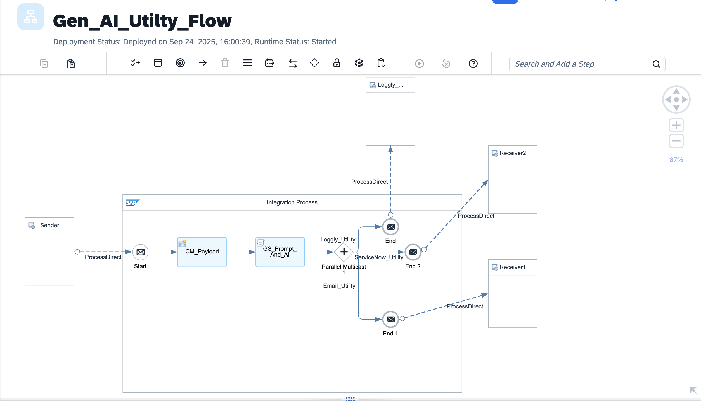

- Set API key securely for AI calls.  
- Use a Groovy script to call AI, parse response, and create error XML.  
- Prepare payloads for ServiceNow, Loggly, and email systems.  
- Use Parallel Multicast to send error details simultaneously to all three systems.

Groovy Script that I used here 

```groovy
import com.sap.gateway.ip.core.customdev.util.Message
import groovy.json.JsonSlurper
import groovy.json.JsonOutput
import java.net.HttpURLConnection
import java.net.URL
import javax.xml.parsers.DocumentBuilderFactory

def Message processData(Message message) {
    def log = messageLogFactory?.getMessageLog(message)
    try {
        // = CONFIG =
        final String GEMINI_URL = "https://generativelanguage.googleapis.com/v1beta/models/gemini-2.0-flash:generateContent"
        final String GEMINI_API_KEY = "Your_Gemini_API_Key" // <-- set your Gemini key
        final String CAPTURE_CUSTOM_ERROR_KEY   = "User-Friendly Error Message:"
        final String CAPTURE_POSSIBLE_REASON    = "Possible Reasons for the Error:"
        final String CAPTURE_POSSIBLE_SOLUTION  = "Possible Steps to Resolve the Error:"
        final String CAPTURE_HTTP_CODE          = "HTTP Response:"

        // = CAPTURE PROPERTIES =
        def camelExceptionCaught = (message.getProperty("CamelExceptionCaught") ?: "").trim()
        def iflowName = message.getProperty("IFlow_Name") ?: "Unknown_IFlow"
        def messageId = message.getProperty("Message_ID") ?: "Unknown_MessageID"
        def errorAttachmentVal = message.getHeader("ErrorAttachment", String.class) ?: ""

        // = FALLBACK: Parse from XML if props missing =
        if (!camelExceptionCaught) {
            try {
                def body = message.getBody(String) ?: ""
                if (body.trim().startsWith("<")) {
                    def factory = DocumentBuilderFactory.newInstance()
                    factory.setNamespaceAware(false)
                    def builder = factory.newDocumentBuilder()
                    def is = new java.io.ByteArrayInputStream(body.getBytes("UTF-8"))
                    def doc = builder.parse(is)
                    def getText = { tag ->
                        def nodes = doc.getElementsByTagName(tag)
                        (nodes.length > 0) ? nodes.item(0).getTextContent().trim() : ""
                    }
                    camelExceptionCaught = getText("Exception_Message") ?: camelExceptionCaught
                    iflowName = getText("IFlow_Name") ?: iflowName
                    messageId = getText("Message_ID") ?: messageId
                }
            } catch (ignore) {}
        }

        // = BUILD SAFE AI PROMPT =
        def aiPromptText = """You are an SAP Integration consultant skilled in troubleshooting in SAP Cloud Integration (CPI).
Below is an error that occurred while processing the integration flow.

Error Details:
Message_ID: ${messageId}
IFlow_Name: ${iflowName}
System Error: ${camelExceptionCaught}

For this error, PLEASE respond using exactly the following format:
1. User-Friendly Error Message: A one sentence description for non-technical stakeholders.
2. Possible Reasons for the Error: List possible CPI causes.
3. Possible Steps to Resolve the Error: Provide troubleshooting steps.
4. HTTP Response: Provide HTTP error code only.
"""
        def requestPayload = [
            contents: [
                [
                    parts: [
                        [ text: aiPromptText ]
                    ]
                ]
            ]
        ]
        def updatedPrompt = JsonOutput.toJson(requestPayload)
        if (log) log.addAttachmentAsString("Gemini Request Prompt", updatedPrompt, "application/json")

        // = CALL GEMINI API =
        def aiResponseText
        try {
            def url = new URL("${GEMINI_URL}?key=${GEMINI_API_KEY}")
            def conn = (HttpURLConnection) url.openConnection()
            conn.setRequestMethod("POST")
            conn.setRequestProperty("Content-Type", "application/json")
            conn.setDoOutput(true)
            conn.outputStream.withWriter("UTF-8") { it.write(updatedPrompt) }
            def responseCode = conn.responseCode
            def responseStream = (responseCode >= 200 && responseCode < 300) ? conn.inputStream : conn.errorStream
            aiResponseText = responseStream?.getText("UTF-8")
        } catch (Exception e) {
            // fallback AI response
            aiResponseText = """{"candidates":[{"content":{"parts":[{"text":"${CAPTURE_CUSTOM_ERROR_KEY} ${camelExceptionCaught}
${CAPTURE_POSSIBLE_REASON} ${e.message}
${CAPTURE_POSSIBLE_SOLUTION} Check API key or network
${CAPTURE_HTTP_CODE} 500"}]}}]}"""
        }
        if (log) log.addAttachmentAsString("Gemini Raw Response", aiResponseText ?: "NULL", "application/json")

        // = PARSE AI RESPONSE =
        def textContent = ""
        try {
            def parsedJson = new JsonSlurper().parseText(aiResponseText)
            textContent = parsedJson?.candidates?.getAt(0)?.content?.parts?.getAt(0)?.text ?: ""
        } catch (ignore) {}

        // = FALLBACK IF AI FORMAT NOT VALID =
        if (!textContent || !textContent.contains(CAPTURE_CUSTOM_ERROR_KEY)) {
            textContent = """${CAPTURE_CUSTOM_ERROR_KEY} ${camelExceptionCaught ?: "Unknown error"}
${CAPTURE_POSSIBLE_REASON} Not provided
${CAPTURE_POSSIBLE_SOLUTION} Not provided
${CAPTURE_HTTP_CODE} 500"""
            if (log) log.addAttachmentAsString("AI Fallback Triggered", textContent, "text/plain")
        }

        def extractedCustomErrorMessage = extractValue(textContent, CAPTURE_CUSTOM_ERROR_KEY) ?: "Not provided"
        def extractedPossibleReason     = extractValue(textContent, CAPTURE_POSSIBLE_REASON) ?: "Not provided"
        def extractedPossibleSolution   = extractValue(textContent, CAPTURE_POSSIBLE_SOLUTION) ?: "Not provided"
        def extractedHTTPCode           = extractHTTPCodeValue(textContent, CAPTURE_HTTP_CODE) ?: "500"

        // = BUILD UNIVERSAL XML (ensure plain String output) =
        def xmlSafe = { val -> val?.replaceAll("&","&amp;").replaceAll("<","&lt;").replaceAll(">","&gt;") ?: "" }
        def universalXml = """<UniversalErrorPayload>
    <ErrorDetails>
        <SystemError>${xmlSafe(camelExceptionCaught)}</SystemError>
        <CustomError>${xmlSafe(extractedCustomErrorMessage)}</CustomError>
        <PossibleReason>${xmlSafe(extractedPossibleReason)}</PossibleReason>
        <PossibleSolution>${xmlSafe(extractedPossibleSolution)}</PossibleSolution>
        <HTTPCode>${xmlSafe(extractedHTTPCode)}</HTTPCode>
    </ErrorDetails>
    <ServiceNow>
        <Active>true</Active>
        <AssignedTo>Beth Anglin</AssignedTo>
        <AssignmentGroup>Database</AssignmentGroup>
        <Description>${xmlSafe(errorAttachmentVal ?: textContent)}</Description>
        <ShortDescription>${xmlSafe(extractedCustomErrorMessage)}</ShortDescription>
        <Priority>5-Planning</Priority>
        <Impact>3-Low</Impact>
        <Urgency>3-Low</Urgency>
        <Category>Database</Category>
        <ContactType>Phone</ContactType>
        <State>In Progress</State>
    </ServiceNow>
    <Loggly>
        <Timestamp>${new Date().format("yyyy-MM-dd'T'HH:mm:ss.SSSZ")}</Timestamp>
        <SystemError>${xmlSafe(camelExceptionCaught)}</SystemError>
        <CustomError>${xmlSafe(extractedCustomErrorMessage)}</CustomError>
        <PossibleReason>${xmlSafe(extractedPossibleReason)}</PossibleReason>
        <PossibleSolution>${xmlSafe(extractedPossibleSolution)}</PossibleSolution>
        <HTTPCode>${xmlSafe(extractedHTTPCode)}</HTTPCode>
        <IFlowName>${xmlSafe(iflowName)}</IFlowName>
        <MessageID>${xmlSafe(messageId)}</MessageID>
    </Loggly>
    <Email>
        <Subject>CPI Alert: ${xmlSafe(extractedCustomErrorMessage)}</Subject>
        <Body><![CDATA[
Dear Team,
An integration error has occurred.
System Error:
${camelExceptionCaught}
Custom Error:
${extractedCustomErrorMessage}
Possible Reason:
${extractedPossibleReason}
Possible Solution:
${extractedPossibleSolution}
HTTP Code: ${extractedHTTPCode}
IFlow: ${iflowName}
Message ID: ${messageId}
Regards,
CPI Monitoring
        ]]></Body>
    </Email>
</UniversalErrorPayload>""".toString()

        message.setBody(universalXml)
        if (log) log.addAttachmentAsString("Universal Error XML", universalXml, "application/xml")

    } catch (Exception fatal) {
        // If any exception occurs (including AI call or logic error), send original error payload
        def originalPayload = message.getBody(String)
        if (log) log.addAttachmentAsString("Groovy Script Fatal Error", fatal.toString(), "text/plain")
        message.setBody(originalPayload?.toString())
    }

    return message
}

// = HELPERS =
def extractValue(String text, String key) {
    def idx = text.indexOf(key)
    if (idx == -1) return null
    def start = idx + key.length()
    def end = text.indexOf("\n\n", start); if (end == -1) end = text.length()
    return text.substring(start, end).replaceAll("\\*", "").trim()
}
def extractHTTPCodeValue(String text, String key) {
    def idx = text.indexOf(key)
    if (idx == -1) return null
    def start = idx + key.length()
    def end = text.indexOf("\n", start); if (end == -1) end = text.length()
    return text.substring(start, end).trim()
}

```

### Step 3: Downstream Notification Flows

- **ServiceNow Flow:** Converts XML to JSON, sends via ServiceNow adapter, includes Escalation End. 

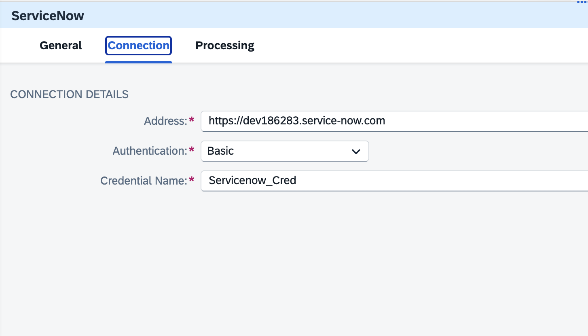


Groovy Script I used here 
```groovy
import com.sap.gateway.ip.core.customdev.util.Message
import groovy.util.XmlSlurper
import groovy.json.JsonOutput

def Message processData(Message message) {
    
    // 1. Get the incoming XML payload as string
    def body = message.getBody(String)
    
    // 2. Parse the XML
    def xml = new XmlSlurper().parseText(body)
    
    // 3. Extract only the <ServiceNow> node
    def serviceNowNode = xml.ServiceNow
    
    // 4. Convert <ServiceNow> content to a Map
    def serviceNowMap = [:]
    serviceNowNode.children().each { node ->
        serviceNowMap[node.name()] = node.text()
    }
    
    // 5. Convert the Map to JSON
    def serviceNowJson = JsonOutput.toJson(serviceNowMap)
    
    // (Optional) Pretty print
    serviceNowJson = JsonOutput.prettyPrint(serviceNowJson)
    
    // 6. Set JSON as the new body
    message.setBody(serviceNowJson)
    
    return message
}
```
- **Loggly Flow:** Sends HTTP requests to logging system with Escalation End.  
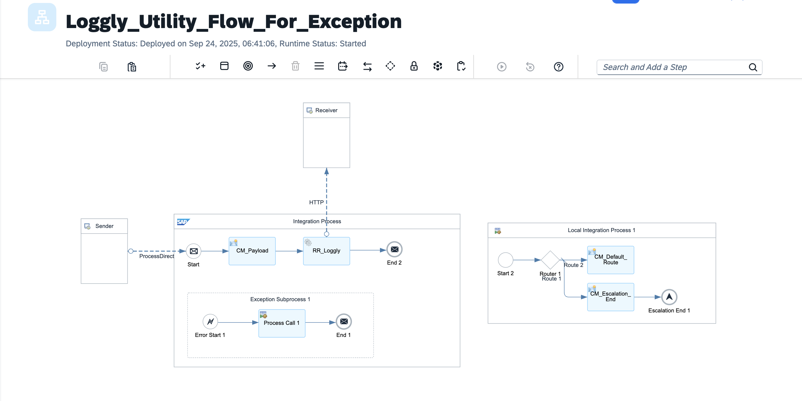
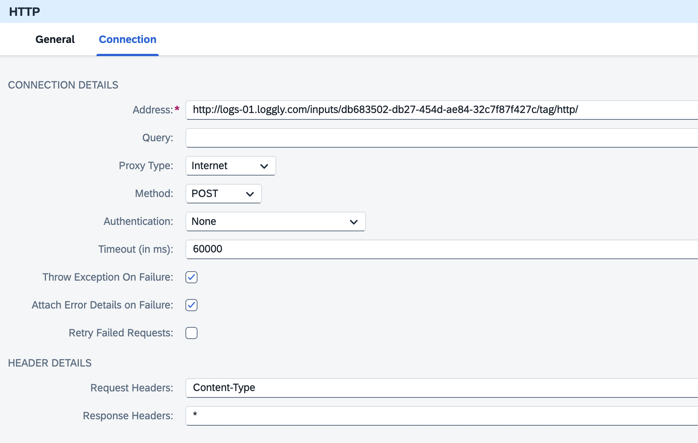

- **Email Flow:** Prepares email content and sends with Mail adapter, including Escalation End.
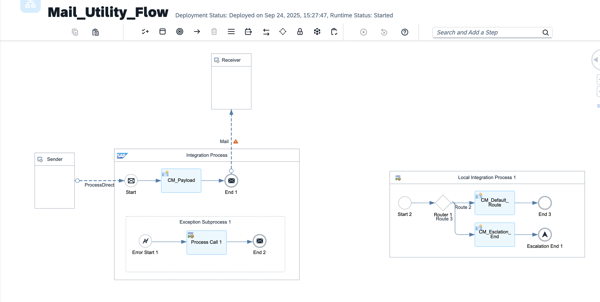
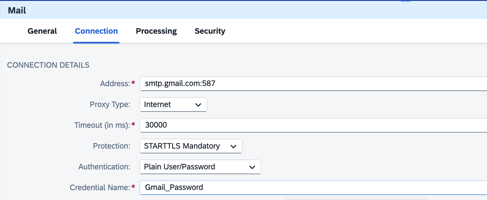
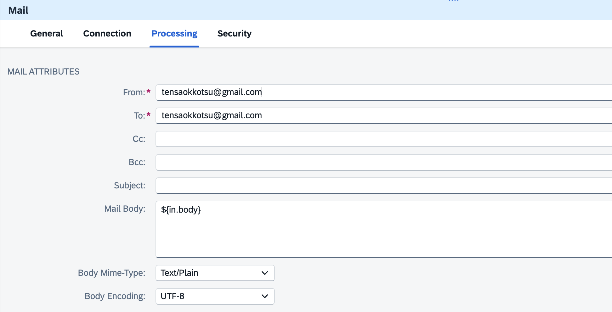
### Step 4: Testing Exception Handling

- You can simulate an error in the Groovy script like so:

```groovy
throw new Exception("Test groovy script error for Integration Suite tolerant flow")
```

- This tests that, even on script failures, the original payload propagates downstream and notifications go out.

---

### 6. Testing through postman


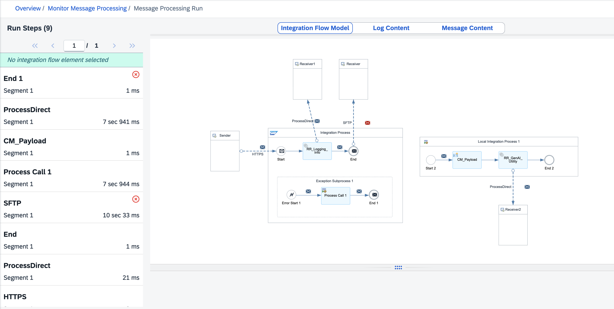
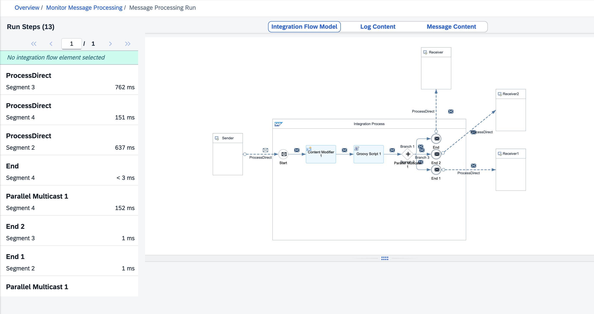
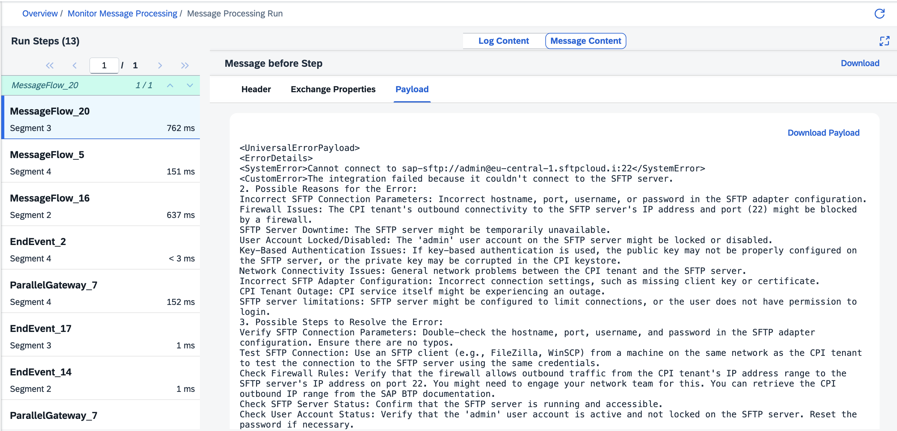

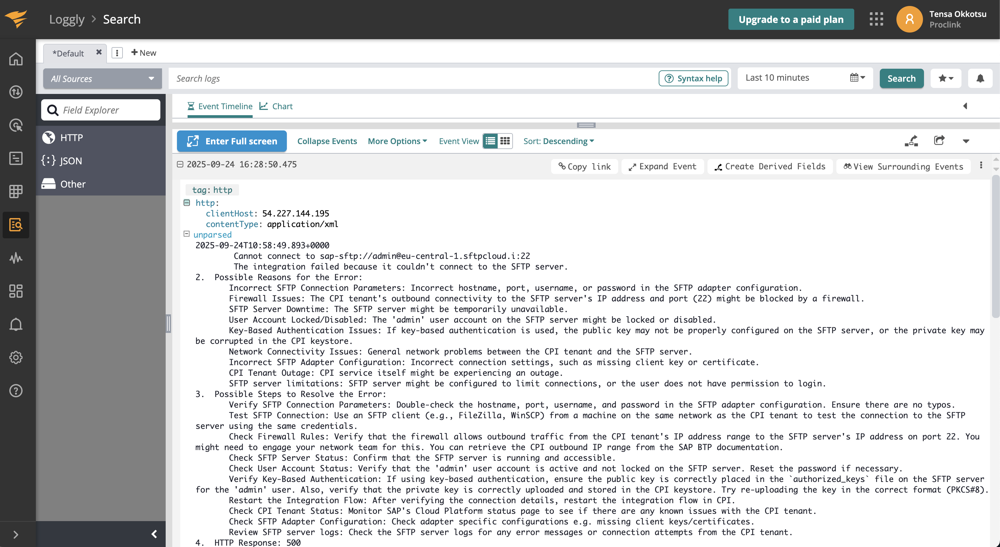
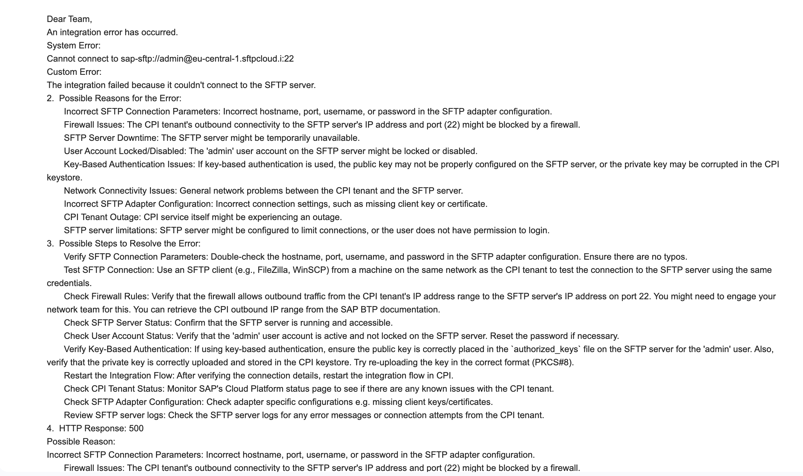
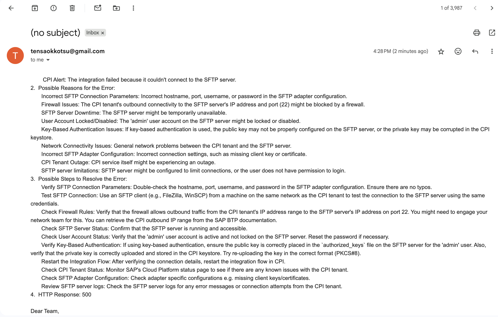

- Universal payload 
```xml
```

## 6. Summary and Closing

This AI-enabled exception handling design lets SAP Integration flows remain fault-tolerant. It provides clear, user-friendly error messages and seamless notifications even during outages or API failures.  
You can apply this strategy to synchronous or asynchronous integration patterns, adjusting Escalation End usage as appropriate.

Feel free to comment or share your experiences with SAP Integration Flows exception handling using AI utilities!  
Happy integrating!


---

*Thanks for reading!*  
